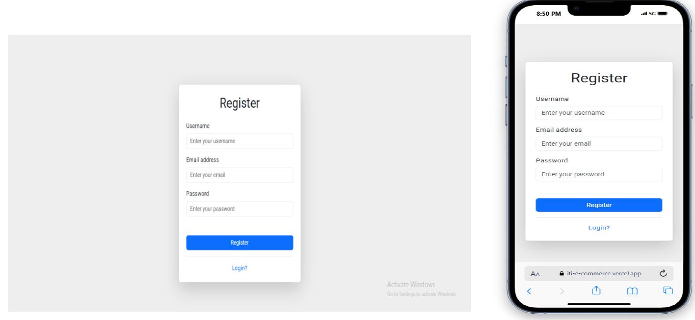
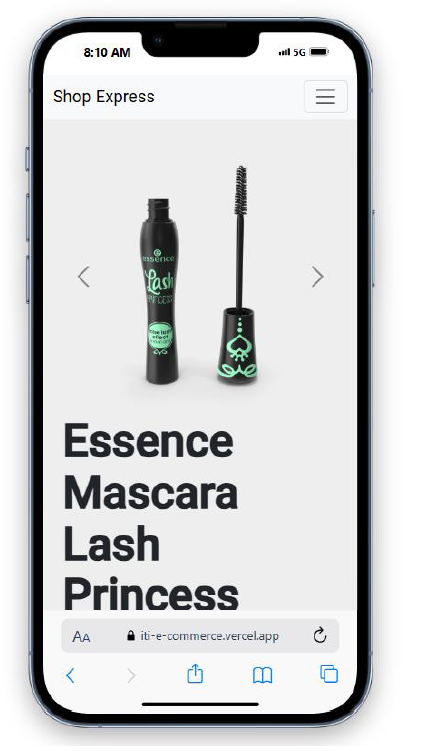

# E-Commerce Website

Shop Express is an ITI summer training project

## Table of Contents

1. [General Info](#general-info)
2. [Tools And Technonlgy](#tools)
3. [Screen shots](#screenshots)
4. [Developers](#team-members)

### General Info

---

The E-Commerce platform is a comprehensive
online shopping solution designed to offer a
seamless and user-friendly experience for both
customers and administrators. This project enables
users to browse products, manage their carts, and
complete purchases online, while providing
administrators with tools to manage inventory,
process orders, and analyze sales data.

### Tools And Technonlgy

---

- Angular
- MongoDB
- NodeJS
- Express
- Bootstrap

### Screen shots

---

Screen shots from desktop and phone

landing Page:

Login Page:

Register Page:

Products Page:

Product Detials Desktop page:

Product Detials Phone page:

Cart Page:

A video <a href="https://drive.google.com/file/d/1PMe7Egx7gL7OKK5KOIMJXj4VaBwuxhqG/view?usp=drive_link" target="_blank">Here</a>

### Developers

---

| Name                | Account                                                                                   |
| ------------------- | ----------------------------------------------------------------------------------------- |
| Abdulrahman Mohamed | @<a href="https://github.com/AbdulrahmanHassan01" target="_blank">AbdulrahmanHassan01</a> |
| Bashar Mohamed      | @<a href="https://github.com/BasharMOhamed" target="_blank">BasharMOhamed</a>             |
| Hussien Ahmed       | @<a href="https://github.com/Mina927/" target="_blank">hussien103</a>                     |
| Seif eldin Ashraf   | @<a href="https://github.com/Seifeldin2510" target="_blank">Seifeldin2510</a>             |
| Mina Nabil          | @<a href="https://github.com/minasanta" target="_blank">minasanta</a>                     |
